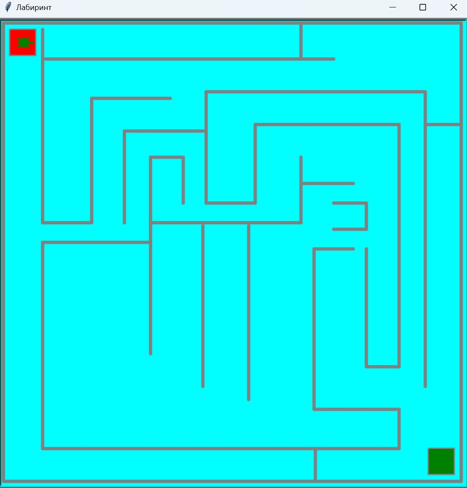
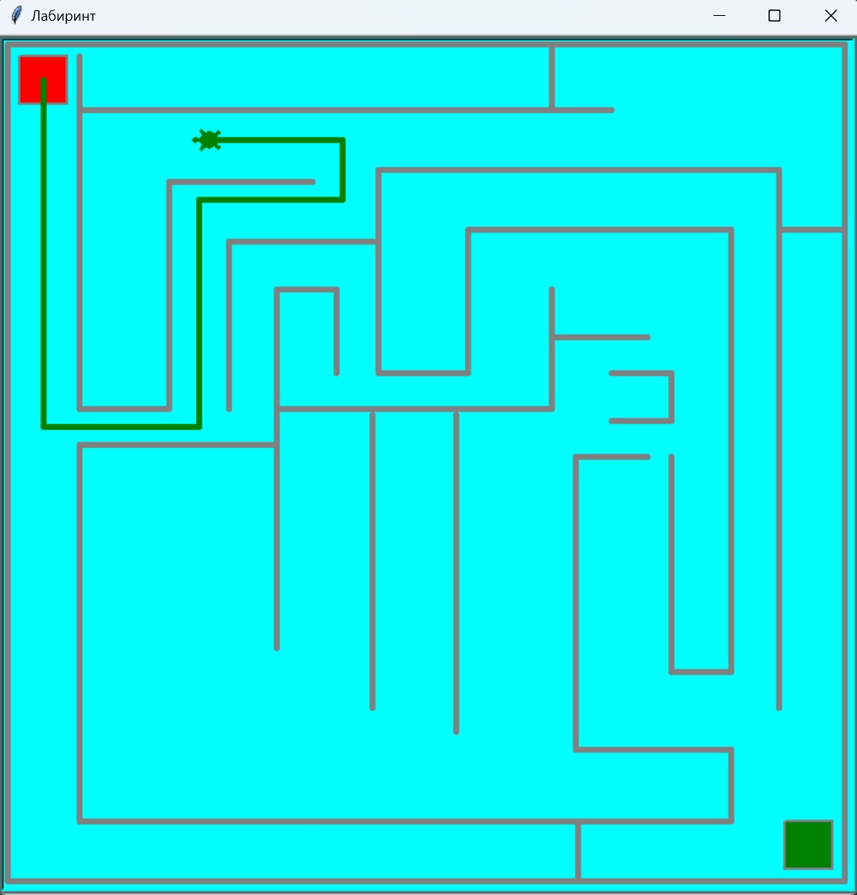
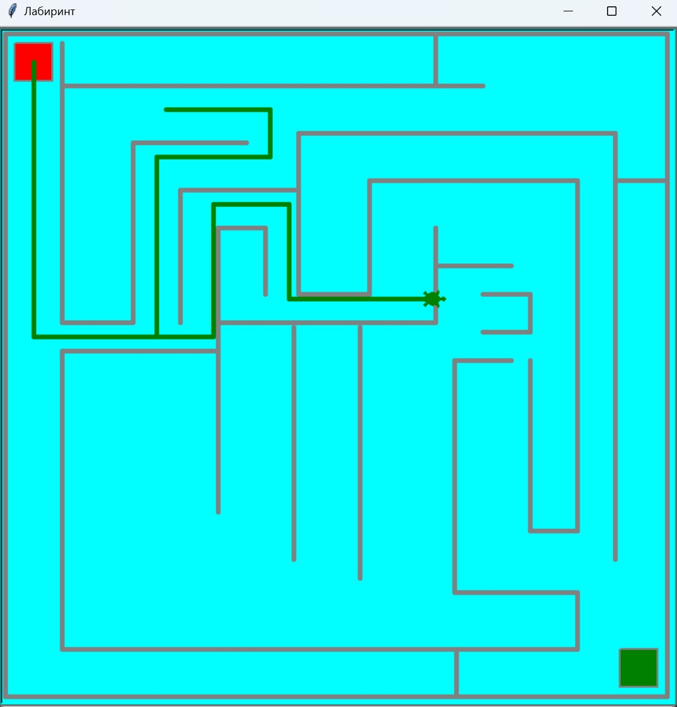
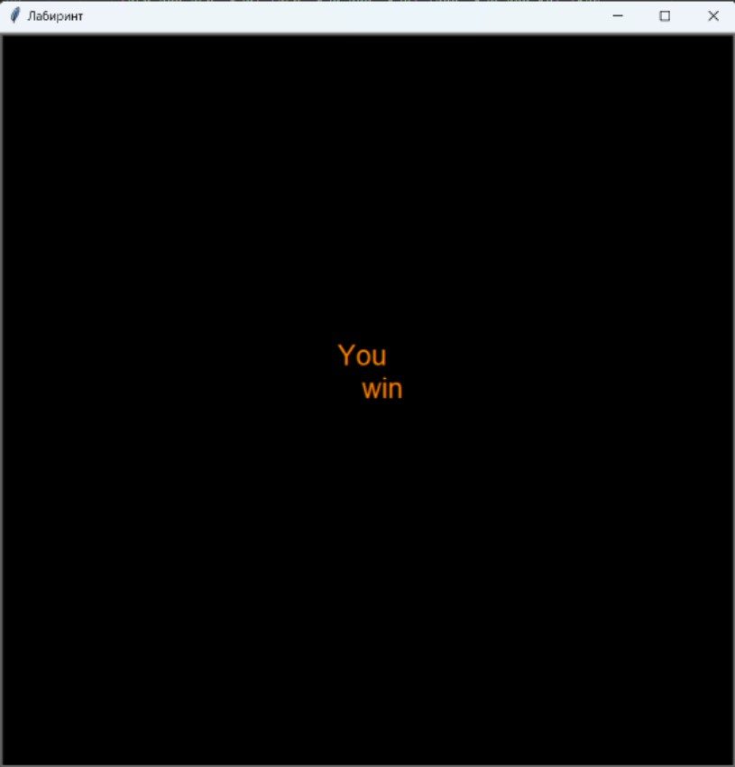
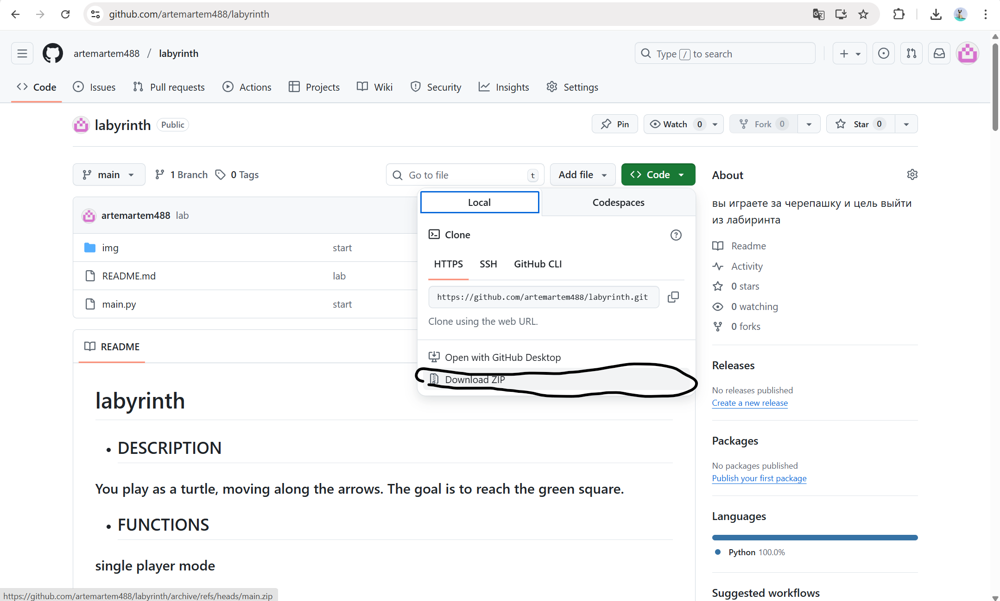
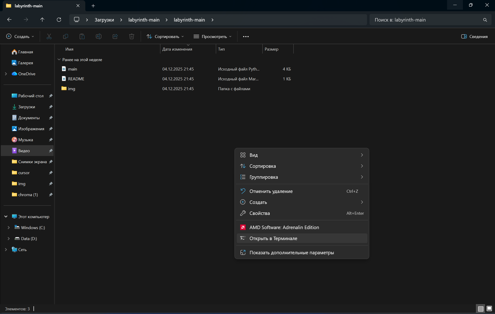

# labyrinth
 
* ## DESCRIPTION

### You play as a turtle, moving along the arrows. The goal is to reach the green square.

* ## FUNCTIONS

### single player mode

### control:
-  up(`⭡`)
-  down(`⭣`)
-  right(`⭢`)
-  left(`⭠`)

* Score Tracking: The game tracks the player's coordinates and checks whether they have reached the green square.
* Wall Physics: Walls cannot be passed through.
* Game End: The player wins when they reach the green square.
* Field Boundaries: The game includes upper, lower, and side boundaries.

* ## SCREENSHOTS

## start:

## walk:

## physicality of the walls:

## declaration of victory:

* ## ЗАПУСК

что бы поиграть в лабиринт нужно:

1 установить python https://www.python.org/downloads/release/python-3126/ по этой ссылки для совей операционной системы (игра писалась на этой версии)

    обязательно поставить галачку на add python.exe to path

2. дальше нужно скачать репозиторий 

    нажать CODE ,потом Download zip

    

    зайти в проводник ->  пкм по папке извлечь все -> зайти в разархивированую папку -> по пустому месту правой кнопкой мыши и открыть в терминале

3. написать pip install shapely
   и дождаться окончания загрузки

4. пишим в терминале python main.py

    

    
